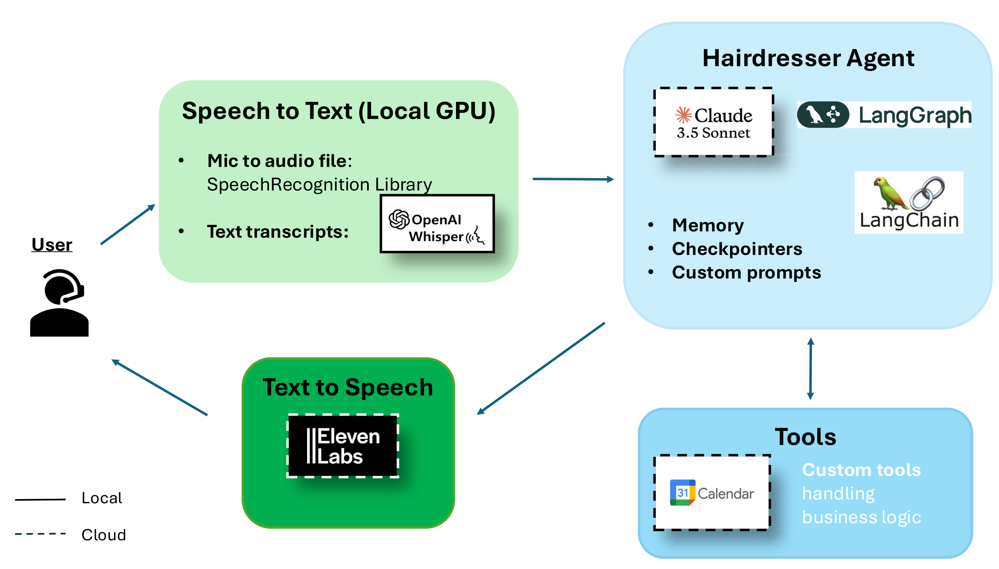

# Agentic Hairdresser

## Overview

Agentic Hairdresser is an AI-powered agentic chatbot that assists customers in booking appointments at a hair salon. The agent interacts dynamically with users to find and confirm available time slots using external tools and APIs.

Check the [VIDEO demo](https://www.loom.com/share/22298871df9944ddb503d26cf8c75bbd?sid=09dd3a89-13f0-4be3-82be-af44eee3f82d) out to see the agent in action!

Also, in this [Medium blog post](https://medium.com/@lgsquare/meet-agentic-hairdresser-a-voice-activated-ai-chatbot-for-seamless-appointment-scheduling-powered-a5af9fcd52a9) you can dive into more details about its implementation and general agentic workflow know-how.

## Features

* **Conversational Booking:** Guides customers through the appointment scheduling process.

* **AI-Powered:** Uses Anthropic Claude 3.7 Sonnet LLM with instructive prompting to simulate a hairdresser assistant.

* **Google Calendar Integration:** Checks available time slots and creates new bookings upon confirmation.

* **Custom Python Tools:** Fetches business logic data such as hairdresser services and pricing.

* **Speech Support:** Converts speech to text and vice versa for a natural user experience.

## Architecture

* **Speech-to-Text Interface:** Utilizes the SpeechRecognition Python package and a locally deployed OpenAI-Whisper model for audio transcription.

* **LLM Framework:** Built with LangGraph and LangChain, leveraging Claude 3.7 Sonnet for customer interactions.

* **Memory & Checkpoints:** Maintains chat history for a seamless conversation flow.

* **Tool Invocation:**

* Queries Google Calendar API to check and book time slots.

* Calls custom Python functions to retrieve business-related data.

* **Text-to-Speech System:** Uses Eleven Labs models to generate human-like responses.

## How It Works

The agent interacts with the customer via text or speech. It queries Google Calendar for available slots. Upon confirmation, it schedules the appointment.

It can provide additional details on services and pricing. The response is synthesized into speech for voice interactions.

## How to run

To run the agent, ensure you have:

* Python installed
* API keys for Antrophic Claude Sonnet and Eleven Labs

Build the Docker image:
`
docker buildx build -f Dockerfile -t awesome-hairdresser-app .
`
run it:
`
docker run --rm -it --device /dev/snd -e PULSE_SERVER=unix:$XDG_RUNTIME_DIR/pulse/native -v $XDG_RUNTIME_DIR/pulse/native:$XDG_RUNTIME_DIR/pulse/native -v ~/.config/pulse/cookie:/root/.config/pulse/cookie --gpus all awesome-hairdresser-app
`

## Contact
leonardo.gutierrez@lgsquare.lu
